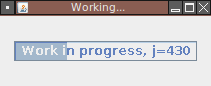
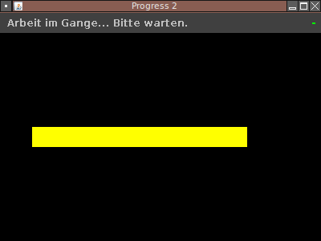

Beschreibung
============

Progress ist ein sehr einfaches Programm, dessen einziger Zweck darin besteht,
eine Fortschrittsanzeige darzustellen, die immer wieder von vorne anfängt.
Progress kann bspw. genutzt werden, um bei rechenintensiven, sehr langen,
Aufgaben, anzuzeigen, dass der Computer nicht abgestürzt ist.

Im Laufe der Zeit wurden drei verschiedene Versionen erfüllt, die den Zweck
jeweils erfüllen. Sie unterscheiden sich im Ressourcenbedarf und den
unterstützten Betriebssystemen.

In diesem Package sind enthalten:

Progress 1 (`progress1`)
:   Die erste Version wurde in Java geschrieben und zeigt ein Fenster mit
    einer einfachen Java-Fortschrittsanzeige und einem fortlaufenden Zähler
    an.

Progress 2 (`progress2j`)
:   Die zweite Version wurde ebenfalls in Java geschrieben, verwendet aber
    eine gelbe und damit besser aus der Ferne erkenntliche Fortschrittsanzeige.
    Diese wird außerdem nicht über Java Swing gezeichnet, sondern mit
    dem Java2D-API direkt.

Progress 2 C (`progress2c`)
:   Diese Version sieht der Java-Version äußerst ähnlich und unterscheidet sich
    von ihr vor allem dadurch, dass sie in C für X11 geschrieben wurde.
    Damit steht unter Linux eine noch ressourcenschonendere Progress-Version
    zur Verfügung.

Kompilation
===========

Alle in diesem Paket enthaltenen Programme können durch Aufruf von
`ant` kompiliert werden. Ein Debian-Package kann bei Vorhandensein der
benötigten Abhängigkeiten zur Paketerstellung durch `ant package` erzeugt
werden.

Unter Windows funktionieren naturgemäß nur die beiden Java-Versionen, sodass
man zum Kompilieren in den Ordnern `progress1` und `progress2j` jeweils `ant jar`
separat aufruft.

Ausführung
==========

Die unterschiedliche Versionen nutzen unterschiedliche Aufrufkonventionen.
Da es nur einen Parameter gibt, hält sich die Komplexität der Bedienung aber
dennoch in engen Grenzen. Die folgende Tabelle zeigt für jede Version, wie man
sie im „graphischen“ und wie im „konsolenbasierten“ Modus startet.

In der Tabelle ist jeweils ein Aufruf für das lokal gebaute Binary/Jarfile
angegeben. Natürlich kann man die Progress-Programme noch einfacher starten,
wenn man das zugehörige Package installiert hat. Dann gibt es für die
Javaprogramme Startskripte, die diese Versionen auch über den Namen `progress1`
bzw. `progress2j` zugänglich machen und die Pfadangaben können beim Aufrufen
weggelassen werden.

Version       Graphische Version          Konsolenversion
------------  --------------------------  -------------------------------
Progress 1    `java -jar progress1.jar`   `java -jar progress1.jar -cmd`
Progress 2    `java -jar progress2j.jar`  `java -jar progress2j.jar -cmd`
Progress 2 C  `./progress2c`              `./progress2c --cmd`

Im Konsolenmodus beendet man die Javaprogramme per Druck auf [ENTER], die
C-Version hingegen per [CTRL]-[C].

Andere Möglichkeiten
====================

Auf ein Programm wie Progress kann man meistens verzichten. Zur Darstellung,
ob der Rechner noch rechnet, sind auch Uhren in den gängigen Benutzeroberflächen
geeignet, die ja mindestens einmal pro Minute auf eine neue Zeit schalten
sollten. Andere einfache Progress-Varianten lassen sich mit
Shellscript-Einzeilern erreichen, hier eine kleine Auswahl:

 * `while sleep 1; do printf x; sleep 1; printf .; done`
 * `tty-clock -s -b -C 3`
 * `zenity --progress --pulsate`
 * `{ while true; do for i in 0 10 20 30 40 50 60 70 80 90; do echo $i; sleep 1; done; done; } | dialog --gauge "Work in progress since $(date)" 7 60`

In speziellen Situationen kann es sein, dass es nicht hinreichend ist, die
Rechneraktivität über den Bildschirm zu signalisieren. In diesem Falle kann
man natürlich einerseits „Aktivitäten“ verursachen, die ohnehin oft über
Lämpchen signalisiert werden (Festplattenzugriffe, Netzwerkaktivität) oder
ähnlich. Eine kreative Lösung kann auch gelegentliches Öffnen und Schließen
von CDROM-Laufwerken oder die Verwendung des Systemlautsprechers sein. Speziell
für den „dauerhaften“ und ressourcenschonenden Einsatz wurden hierzu zwei
weitere Ma_Sys.ma Programme entwickelt:
[ma_capsblinker(32)](ma_capsblinker.xhtml) und [maerct(32)](maerct.xhtml).
